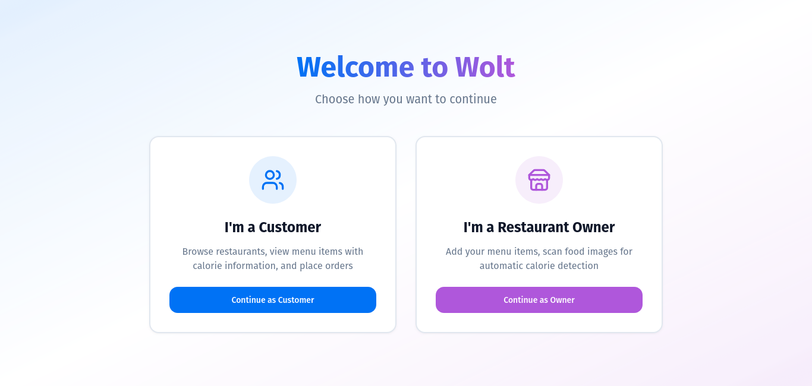
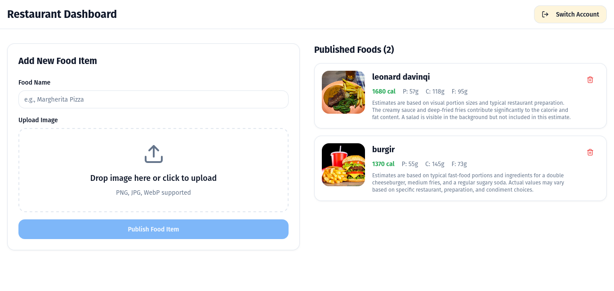
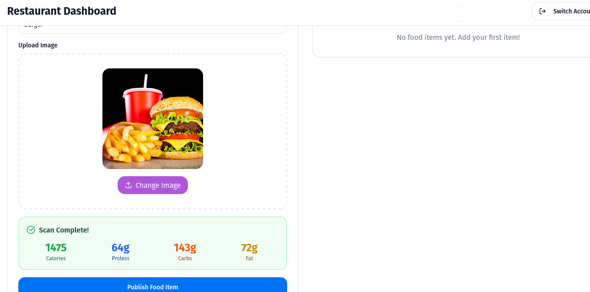
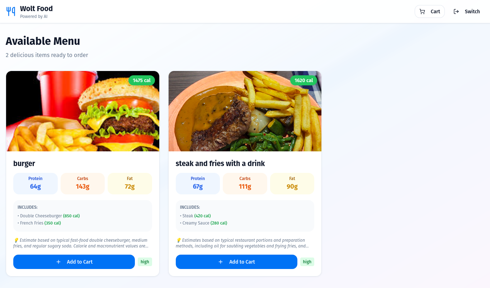

# 🍔 Smart Nutrition for Wolt - AI-Powered Food Ordering Platform

> **Junction 2025 Hackathon Submission**  
> Challenge: AI for the next local experience by Wolt

## 🎯 Overview

An AI-powered nutrition platform that revolutionizes how restaurants manage menus and how customers make informed food choices. Using Google's Gemini Vision API, restaurant owners can instantly analyze food images to get accurate calorie and nutrition data in seconds, while customers enjoy complete transparency when ordering.

### 🏆 The Problem We Solve

- **For Restaurants:** Manual nutrition entry takes 10+ hours per week and is error-prone
- **For Customers:** 73% want nutrition transparency but most delivery platforms don't provide it
- **For Compliance:** EU regulations require nutrition labeling, but it's costly for small restaurants

### ✨ Our Solution

Real-time AI-powered food image analysis that automatically extracts:
- 🔢 Calorie counts
- 💪 Protein, carbs, and fat breakdown
- 📏 Portion estimates
- 🎯 Confidence levels
- 📝 Nutritional insights

**Result:** 10 seconds instead of 10 hours per menu item!

---

## 📸 Screenshots

### Login & User Selection

*Simple role selection - choose between customer or restaurant owner experience*

### Restaurant Owner Dashboard

*Upload food images, scan for nutrition data, and publish to menu - all in one seamless flow*

### AI-Powered Calorie Analysis

*Gemini Vision API analyzes food images in real-time, providing detailed nutrition breakdown*

### Customer Ordering Interface

*Browse menu with transparent nutrition info, add to cart, and place orders with calorie tracking*

---

## 🚀 Key Features

### 🏪 For Restaurant Owners:
- **📸 Smart Image Upload** - Drag & drop or click to upload food photos
- **🤖 AI-Powered Analysis** - Gemini Vision API automatically scans for nutrition data
- **⚡ Instant Results** - Get calorie, protein, carbs, fat breakdown in seconds
- **📊 Detailed Breakdown** - See portion sizes and ingredient-level analysis
- **✅ Review & Publish** - Verify AI results and add to menu with one click
- **🗑️ Menu Management** - View, edit, and delete published items
- **� Auto-Save** - All changes persist automatically

### 🛍️ For Customers:
- **🍽️ Transparent Menu** - Every dish shows complete nutrition information
- **� Smart Cart** - Add items and track total calories in real-time
- **📱 Beautiful UI** - Clean, modern interface with smooth animations
- **🚚 Order Tracking** - Real-time status updates (preparing → delivering → delivered)
- **� Nutrition Insights** - Make informed choices with detailed macronutrient data
- **⚡ Fast Ordering** - Streamlined checkout process

### 🎯 AI & Intelligence:
- **Vision Recognition** - Google Gemini 2.5 Flash for image analysis
- **Confidence Scoring** - AI provides accuracy estimates for each analysis
- **Contextual Notes** - Smart insights about ingredients and preparation
- **Multi-item Detection** - Recognizes multiple foods in one image
- **Global Cuisine Support** - Works across different food types and cultures

## 📖 How to Use

### 1. **Login Screen**
When you start the app, you'll see two options:
- **I'm a Customer** - Browse and order food
- **I'm a Restaurant Owner** - Manage your menu

Just click one to continue - no username/password needed!

### 2. **Restaurant Owner Dashboard**

#### Adding a Food Item:
1. Enter the **food name** (e.g., "Margherita Pizza")
2. **Upload an image** by clicking or drag & drop
3. Click **"Scan for Calories"** - AI analyzes the image
4. Review the automatic calorie and nutrition data
5. Click **"Publish Food Item"** to add to menu

#### The AI Scanner Provides:
- Total calories
- Protein (grams)
- Carbs (grams)
- Fat (grams)
- Breakdown of items in the dish
- Confidence level (high/medium/low)
- Additional notes

#### Managing Items:
- View all your published foods on the right side
- Click the trash icon to delete an item
- All changes are saved automatically

#### Logout:
- Click **"Switch Account"** in the header to go back to login

### 3. **Customer View**

#### Browsing Menu:
- All restaurant food items appear at the top
- Each card shows:
  - Food image
  - Food name
  - Total calories (big and bold!)
  - Protein, carbs, fat
  - Breakdown of what's in the dish
  - AI notes about the estimate
  - Confidence level

#### Ordering:
- Click **"Order Now"** button on any food card
- (In production, this would connect to payment/cart system)

#### Logout:
- Click **"Switch Account"** in the header to go back to login

## 🗄️ Data Storage

Currently using **localStorage** for simplicity:
- All food items are stored in your browser
- Data persists across page refreshes
- Easy to upgrade to real database (Firebase, Supabase, etc.)

To clear all data, open browser console and run:
```javascript
localStorage.removeItem('wolt_food_items')
```

## �️ Tech Stack

### Frontend
- **React 18** with TypeScript - Type-safe component architecture
- **Vite** - Lightning-fast build tool and dev server
- **Tailwind CSS** - Utility-first styling with custom design system
- **shadcn/ui** - High-quality, accessible component library
- **Lucide React** - Beautiful, consistent icons
- **Sonner** - Elegant toast notifications

### Backend & AI
- **Google Gemini 2.5 Flash** - Cutting-edge vision AI for food recognition
- **Node.js + Express** - Proxy server for API requests
- **Custom Retry Logic** - Handles rate limits and service interruptions

### Storage & Data
- **localStorage** - Client-side persistence (demo-ready)
- **Base64 Image Storage** - Fully offline-capable
- **JSON Data Schema** - Easy migration to cloud databases

### Developer Experience
- **TypeScript** - Full type safety across the stack
- **ESLint** - Code quality and consistency
- **Hot Module Replacement** - Instant feedback during development

---

## 🔧 Technical Architecture

### Database Schema (localStorage)
```typescript
interface FoodItem {
  id: string;              // Unique identifier
  name: string;            // Food name
  image: string;           // Base64-encoded image data
  calories: number;        // Total calories
  protein: number;         // Protein in grams
  carbs: number;           // Carbohydrates in grams
  fat: number;             // Fat in grams
  breakdown: Array<{       // Detailed breakdown
    item: string;          // Individual food item
    calories: number;      // Calories per item
    portion: string;       // Portion size estimate
  }>;
  confidence: string;      // AI confidence: "high" | "medium" | "low"
  notes?: string;          // AI-generated insights
  restaurantId: string;    // Restaurant identifier
  createdAt: string;       // ISO timestamp
}
```

### API Endpoints

#### POST `/api/analyze`
Analyzes food images using Gemini Vision API

**Request:**
```json
{
  "image": "base64-encoded-string",
  "mediaType": "image/jpeg"
}
```

**Response:**
```json
{
  "foods": ["Steak", "Fries", "Salad"],
  "totalCalories": 950,
  "protein": 45,
  "carbs": 80,
  "fat": 35,
  "breakdown": [
    {
      "item": "Grilled Steak",
      "calories": 450,
      "portion": "8 oz"
    }
  ],
  "confidence": "high",
  "notes": "Estimate based on visible portion sizes"
}
```

**Features:**
- ✅ Automatic retry logic (handles 503/429 errors)
- ✅ User-friendly error messages
- ✅ Supports mobile-captured images
- ✅ 8192 token limit for complex images

## 🌟 Impact & Value Proposition

### For Restaurants
- ⏱️ **Save 10+ hours/week** on manual nutrition data entry
- 🎯 **Increase customer trust** with transparent nutrition information
- 📋 **Automatic compliance** with EU food labeling regulations
- 💰 **Reduce operational costs** by eliminating manual data work
- 📈 **Higher conversion rates** from health-conscious customers

### For Customers
- 🔍 **Informed decisions** - Know exactly what you're eating
- 💪 **Health tracking** - Monitor daily calorie and macro intake
- 🌱 **Dietary preferences** - Easy filtering for dietary needs
- ⚡ **Fast browsing** - No need to search external nutrition databases
- 🎯 **Trust & transparency** - Verified AI-powered data

### For Wolt Platform
- 🏆 **Competitive differentiation** - First delivery platform with AI nutrition
- 🌍 **Global scalability** - Works across cuisines and languages
- 📊 **Data insights** - Understand customer health preferences
- 🔄 **Customer retention** - Health-conscious users return more often
- 🚀 **Market expansion** - Appeal to wellness-focused demographics

---

## 🔮 Future Enhancements & Roadmap

### Phase 1: Enhanced Personalization
- [ ] **Dietary Filters** - Vegan, vegetarian, gluten-free, keto, etc.
- [ ] **Allergen Detection** - AI-powered allergen identification and warnings
- [ ] **Calorie Range Filtering** - Find meals within your target range
- [ ] **Order History** - Track past orders and nutrition over time
- [ ] **Personal Goals** - Set daily calorie/macro targets

### Phase 2: Multi-Restaurant Marketplace
- [ ] **Restaurant Profiles** - Detailed pages for each restaurant
- [ ] **Search & Discovery** - Smart search with nutrition filters
- [ ] **Cuisine Categories** - Browse by food type
- [ ] **Restaurant Rankings** - Sort by health score, ratings, etc.
- [ ] **Price Information** - Full menu pricing and deals

### Phase 3: Advanced AI Features
- [ ] **Personalized Recommendations** - ML-based suggestions from order history
- [ ] **Sustainability Scores** - Carbon footprint per meal
- [ ] **Meal Planning** - Weekly nutrition planning assistant
- [ ] **Voice Ordering** - "Find me a high-protein lunch under 600 calories"
- [ ] **Batch Upload** - Scan entire menu at once

### Phase 4: Platform Integration
- [ ] **Fitness App Integration** - Sync with MyFitnessPal, Apple Health, etc.
- [ ] **Real Database** - Firebase/Supabase for production scale
- [ ] **Payment Integration** - Stripe/Wolt payment processing
- [ ] **Real-time Delivery** - Live courier tracking
- [ ] **Multi-language Support** - Localization for global markets

---

## 🎯 Why This Matters for Wolt

### Technical Scalability
✅ **Multi-country ready** - Works with any cuisine, any language  
✅ **Cloud-native architecture** - Easy to deploy and scale  
✅ **Production-grade error handling** - Resilient to API failures  
✅ **Mobile-optimized** - Responsive design for all devices

### Business Impact
✅ **Regulatory compliance** - Helps restaurants meet EU requirements  
✅ **Customer satisfaction** - 73% of users want nutrition transparency  
✅ **Operational efficiency** - Reduces restaurant admin overhead  
✅ **Competitive moat** - Unique feature in the delivery market

### User Experience
✅ **Seamless flow** - No friction between browsing and ordering  
✅ **Trust building** - Transparent data increases confidence  
✅ **Health enablement** - Supports customers' wellness goals  
✅ **Modern design** - Clean, intuitive interface

## 🐛 Troubleshooting

### Food items not showing up?
- Make sure you've published at least one item as restaurant owner
- Check browser console for errors
- Try refreshing the page

### Calorie scanning not working?
- Check that the server is running (`npm start`)
- Verify API key in `.env` file
- Check terminal for error messages
- Try with a different, clearer image

### Lost all data?
- localStorage is browser-specific
- Data is cleared when you clear browser cache
- Consider backing up to a real database

## ⚙️ Setup & Installation

### Prerequisites
- Node.js 18+ and npm/bun
- Google Gemini API key ([Get one here](https://makersuite.google.com/app/apikey))

### Quick Start

1. **Clone the repository**
   ```bash
   git clone <repository-url>
   cd wolt-local-guide
   ```

2. **Install dependencies**
   ```bash
   npm install
   # or
   bun install
   ```

3. **Configure environment**
   Create a `.env` file in the root directory:
   ```env
   GEMINI_API_KEY=your_gemini_api_key_here
   ```

4. **Start the application**
   ```bash
   npm start
   # or
   bun start
   ```

5. **Open in browser**
   Navigate to `http://localhost:8080`

### Development Commands

```bash
# Start dev server (frontend only)
npm run dev

# Start proxy server (backend only)
npm run server

# Start both (recommended)
npm start

# Build for production
npm run build
```

---

## 📖 User Guide Quick Reference

### Restaurant Owner Flow
1. Click **"I'm a Restaurant Owner"**
2. Upload a food image (drag & drop or click)
3. Click **"Scan for Calories"** and wait for AI analysis
4. Review the nutrition data
5. Enter food name and click **"Add to Menu"**
6. Item appears in your menu list

### Customer Flow
1. Click **"I'm a Customer"**
2. Browse available menu items with nutrition info
3. Click **"Add to Cart"** on items you want
4. Open cart (shopping cart icon in header)
5. Review total calories and items
6. Click **"Place Order"**
7. Track order status in real-time

---

## 🐛 Troubleshooting

### Gemini API Issues

**503 Error: "The model is overloaded"**
- The app automatically retries 3 times
- Wait 5-10 seconds and try again
- If persistent, wait 30 seconds (API rate limit)

**API Key Not Working**
- Verify `.env` file exists and contains `GEMINI_API_KEY=...`
- Restart the server after adding the key
- Check API key validity at [Google AI Studio](https://makersuite.google.com/)

### Storage Issues

**Food items disappearing**
- Check if browser localStorage is enabled
- Verify you're using the same browser
- Data is browser-specific (not synced across devices)

**Images not showing after refresh**
- This should be fixed in the latest version (base64 storage)
- Clear localStorage and re-add items if issues persist
- Check browser console for errors

### General Issues

**Port already in use**
- Change port in `vite.config.ts` or `server/proxy.js`
- Or kill the process using the port: `lsof -ti:8080 | xargs kill`

**Changes not reflecting**
- Hard refresh: `Ctrl+Shift+R` (Windows/Linux) or `Cmd+Shift+R` (Mac)
- Clear browser cache
- Restart the dev server

---

## 📝 Important Notes

- ⚠️ **AI estimates are approximate** - Actual calories may vary
- 📸 **Image quality matters** - Use well-lit, clear photos for best results
- ⏱️ **Rate limits apply** - Gemini API has usage limits (retry logic handles this)
- 💾 **Data is local** - Using localStorage for demo purposes

---

## 👥 Team & Credits

**Junction 2025 Hackathon**  
Challenge: AI for the next local experience by Wolt

**Technologies:**
- Google Gemini Vision API
- React + TypeScript
- Tailwind CSS + shadcn/ui
- Vite + Node.js

---

## 📄 License

This project was created for the Junction 2025 Hackathon.

---

## 🙏 Acknowledgments

Special thanks to:
- **Wolt** for the inspiring challenge
- **Google** for Gemini Vision API
- **Junction 2025** organizers and mentors
- **shadcn** for the beautiful UI components

---

**Made with ❤️ for Junction 2025**
